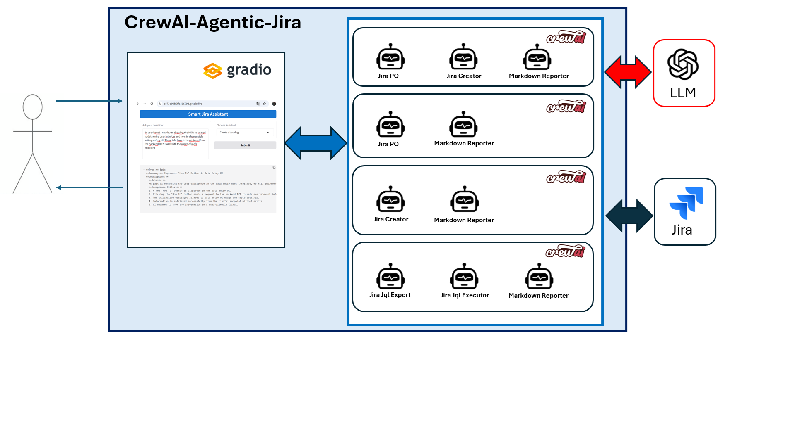
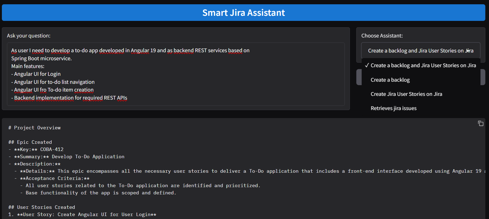

## CrewAI-Agentic-Jira


---

## 🚀 Introduction
**CrewAI-Agentic-Jira** is a project designed to **automate processes in Jira** using the **CrewAI framework** and Generative AI agents. It simplifies common Jira operations like creating, querying, and managing issues, while showcasing the potential of AI-driven task automation.

This project includes two main components:
1. A **command-line interface (CLI)** for executing CrewAI flows.
2. A **web application** built with Gradio, providing an intuitive way to interact with the system and explore its features.

---

## 🌟 Features
- **Process Automation**:
  - Automates the creation of User Stories, Epics, and Tasks in Jira.
  - Allows natural language queries to retrieve and manage Jira issues.
  
- **Dual Interfaces**:
  - **CLI**: Execute CrewAI flows directly from the command line with `main.py`.
  - **Web App**: Interact with Jira via a user-friendly Gradio
  -  web interface (`main_web_gradio.py`).
  


- **Customizable AI Agents**:
  - Select from multiple AI-powered agents, each tailored for specific Jira operations.
  - Extendable backend for adding new bots and workflows.

- **Integration with Jira**:
  - Uses Jira's Python API to perform real-time operations.
  - Securely manages API tokens for authentication.

---

## 🛠️ Installation

### Prerequisites
- **Python** 3.8 or later
- **pipenv** for environment management
- A valid **Jira API token**
- Internet connection to fetch dependencies and interact with Jira's API

### Steps
1. **Clone the Repository**
   ```bash
   git clone https://github.com/rosidotidev/CrewAI-Agentic-Jira.git
   cd CrewAI-Agentic-Jira
   ```

2. **Set Up Environment with pipenv**
   Install dependencies and activate the virtual environment:
   ```bash
   pipenv command reported within setup.txt
   pipenv shell
   ```

3. **Set Up Environment Variables**
   Create a `.env` file in the project directory and add the following variables:
   ```
   JIRA_URL=...
   JIRA_USERNAME=...
   JIRA_API_TOKEN=...
   JIRA_PROJECT=
   OPENAI_API_KEY=...
   OPENAI_MODEL_NAME=...
   ```

4. **Run the Application**
   - **For Command Line Interface (CLI)**:
     ```bash
     python main.py
     ```

   - **For Web Application**:
     ```bash
     python main_web_gradio.py
     ```

---

## 📂 Project Structure
Here’s an overview of the key files in this project:

- **`main.py`**:
  - A command-line tool to execute CrewAI flows for automating Jira tasks.
  
- **`main_web_gradio.py`**:
  - A Gradio-based web interface for interacting with CrewAI and Jira.

- **`Pipfile`**:
  - Contains all dependencies managed by pipenv.

- **`setup.txt`**:
  - pipenv command to setup the project

- **`.env`**:
  - Contains sensitive environment variables like API tokens and Jira credentials.

---

## 🌐 GitHub Repository
Find the full source code and contribute to the project here:  
🔗 [CrewAI-Agentic-Jira on GitHub](https://github.com/rosidotidev/CrewAI-Agentic-Jira)

---

## 🎯 About the Web Interface
The included **Gradio-based web interface** demonstrates the capabilities of CrewAI-Agentic-Jira:
- Allows users to select AI agents via a dropdown.
- Provides a multi-line input field for complex queries or descriptions.
- Displays bot responses and real-time interactions with Jira.

---

## 🧑‍💻 License
This project is licensed under the MIT License. See the `LICENSE` file for details.
