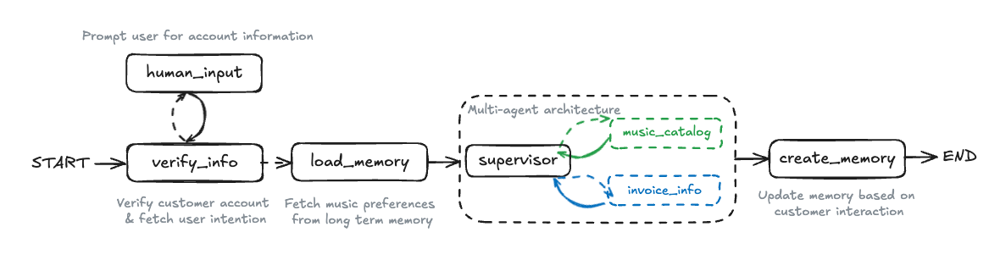

# Multi-Agent AI System: Step-by-Step Implementation

This directory contains a step-by-step implementation of the multi-agent system described in the original Jupyter notebook, but refactored to use Ollama as the LLM backend instead of OpenAI.

Each Python file in the `steps` directory represents a logical step in building the multi-agent system, allowing for easier understanding, iteration, and review of the project design.

## Architecture

The final architecture involves:

1. Customer verification (human-in-the-loop)
2. Loading user preferences from long-term memory
3. A supervisor agent that routes queries to specialized sub-agents:
   - Music catalog sub-agent
   - Invoice information sub-agent
4. Saving new user preferences to long-term memory



## Step Files

The implementation is broken down into the following steps:

1. **step-01-setup_ollama.py**: Configures the Ollama client and LLM setup
2. **step-02-database_setup.py**: Sets up the Chinook database for music and customer data
3. **step-03-memory_setup.py**: Initializes short-term and long-term memory systems
4. **step-04-state_definition.py**: Defines the State TypedDict for agent state management
5. **step-05-music_tools.py**: Creates tools for the music catalog sub-agent
6. **step-06-music_assistant_node.py**: Implements the music assistant node logic
7. **step-07-music_react_graph.py**: Builds the music catalog sub-agent graph
8. **step-08-invoice_tools.py**: Creates tools for the invoice sub-agent
9. **step-09-invoice_agent_prebuilt.py**: Implements the invoice sub-agent using LangGraph's pre-built ReAct agent
10. **step-10-supervisor_agent.py**: Creates the supervisor agent that routes between sub-agents
11. **step-11-human_in_the_loop.py**: Adds customer verification with human-in-the-loop capabilities
12. **step-12-long_term_memory.py**: Implements long-term memory for user preferences
13. **step-13-swarm_agents.py**: Creates a swarm-based version of the agent system (alternative architecture)
14. **step-14-evaluation.py**: Sets up evaluation frameworks for the agent system

## Running the Steps

Before running any scripts, ensure you activate the Pipenv shell to set up the correct environment:

```bash
pipenv shell
```

Each step file can be executed independently (assuming previous steps have been run or imported). For example:

```bash
cd my-step-by-step/steps
python step-01-setup_ollama.py  # Test the Ollama setup
python step-12-long_term_memory.py  # Run the complete agent with memory
```

## Requirements

- Python 3.8+
- [Ollama](https://ollama.com/) installed and running locally with at least one model pulled (e.g., `llama3`)
- The requirements specified in `requirements.txt` or `Pipfile`

## Step-by-Step vs. Notebook

The original notebook implementation is preserved in `multi_agent.ipynb`, while the Ollama adaptation is in `multi_agent_ollama.ipynb`. The step files provide a more modular approach that enables:

1. Better isolation and testing of components
2. Easier debugging and modification
3. A clear progression through the system design
4. Flexibility to use different LLM backends

## Next Steps

- Implement proper error handling across all steps
- Add more comprehensive testing
- Create a unified runner script that executes all steps in sequence
- Enhance the documentation with examples for each step
